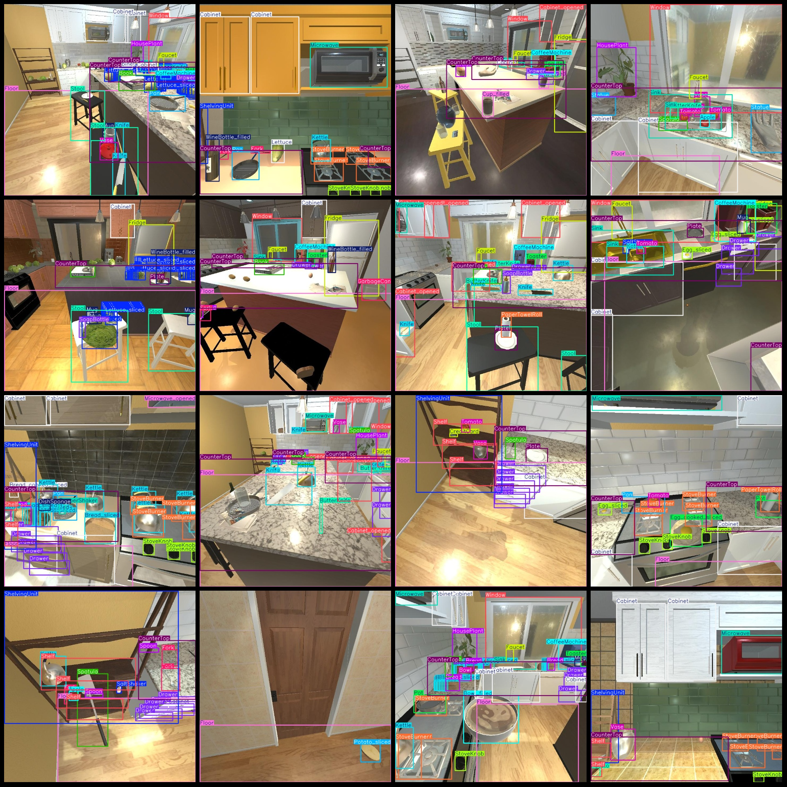
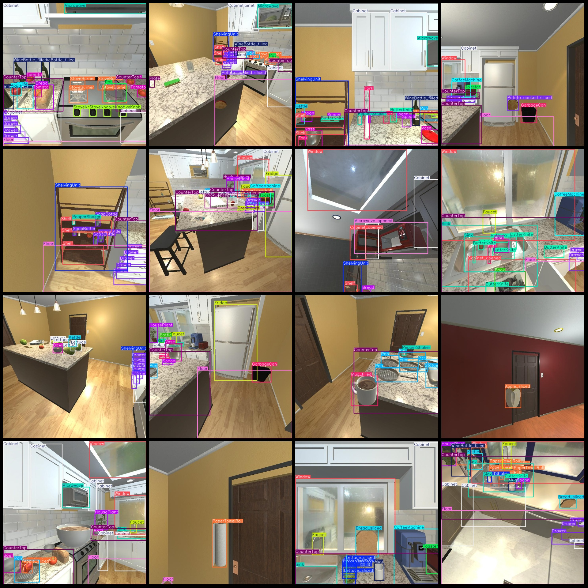

# Kitchenware, Objects, Food Detection Dataset VOC+YOLO format with 9366 images and 69 classes

```
# Kitchenware and Food Detection Dataset (VOC+YOLO format, 9366 images, 69 categories)


The number of frames for "Bread_cooked_sliced" is 230.
The Cabinet_opened box has 1576 frames.
The number of frames for "Egg_cooked_sliced" is 344.
Sink Frames = 3715
SoapBottle Frames = 2083
Spatula Frames = 1033
Spoon Frames = 2356
Statue Frames = 1814
Stool Frames = 2839
StoveBurner Frames = 7571
StoveKnob Frames = 3041
Toaster Frames = 1855
Tomato Frames = 1340
Tomato_sliced Frames = 3644
Vase Frames = 2360
Window Frames = 3616
WineBottle Frames = 1058
WineBottle_filled Frames = 1324
Total number of frames: 168,696
Image resolution: 720x720
Labeling tool used: labelImg
Labeling rules: Draw a rectangle around the category
Important note: The dataset does not have a split into training, validation, and test sets; you need to manually divide it.
Special notice: This dataset does not guarantee the accuracy of the trained models or the weight files.
```
## Images





Here is a pay link on Stripe ( https://buy.stripe.com/3cs8yP7sY87d0vu9AB ). Please contact me lonlonago@foxmail.com after funding $89, and I will send you a complete data files , thank you!


